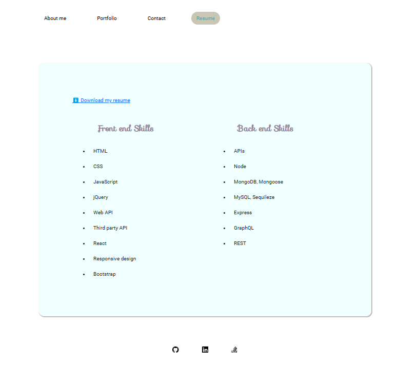

# ekhay_dev_hub

[]
(https://opensource.org/licenses/MIT)

## Description

This project is a personal portfolio website built with React, designed to showcase my skills, projects, and experiences as a developer. The website includes several key sections:

- About Me: A brief introduction to who I am, my background, and what I am passionate about as a developer. This section provides insights into my journey, motivation, and the core values that drive my work.

- Portfolio: A collection of the projects I’ve worked on, each showcasing different skills and technologies. Visitors can explore my work through detailed descriptions and links to live demos or repositories.

- Contact Me: A page where visitors can easily get in touch with me through a contact form. This section also includes links to my social media profiles and other ways to connect.

- Resume: A comprehensive overview of my developer skills, work experiences, and education. There’s also an option to download my resume directly from the site for convenience.

## Tabel of Contents

- [Description](#Description)
- [Installation](#Installation)
- [Usage](#Usage)
- [License](#License)
- [Questions](#Questions)

## Installation

- Install the packages that were used in this project: npm i init
- Run the Portfolio as production perview: npm run perview
- Run portfolio as a dev: npm run dev

## Usage

Once the project is up and running, users can navigate through the portfolio by following these steps:

### Home Page (About Me):

Start with the introduction that gives an overview of who I am as a developer. Learn about my background, skills, and what drives me in the tech industry.

### Portfolio Page:

Browse through the list of projects I’ve worked on. Each project includes a title, the technologies used, and links to live demos or GitHub repositories for more detailed exploration.

### Contact Me Page:

This page will be use as a form of contact, head over to the Contact page and fill out the contact form to send me a message directly, or connect with me via Linkedin provided.

### Resume Page:

Resume page provide detailed of my technical skills. Other information and education can access by downloading the PDF version of my resume by clicking the download button for easy access.

## License

    MIT

### Questions:

- For any question please use the following email address
  ekhay1@outlook.com
- Githab repository: https://github.com/ekhay-hit

## Visuals

- Deplyed URL: https://main--melodic-gnome-f30d8b.netlify.app/
- ScreenShots:

  
  
  
  
